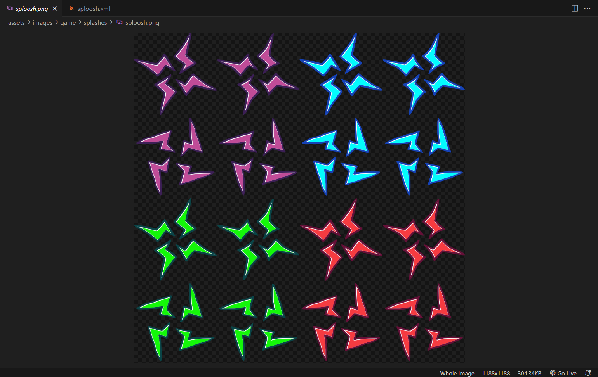
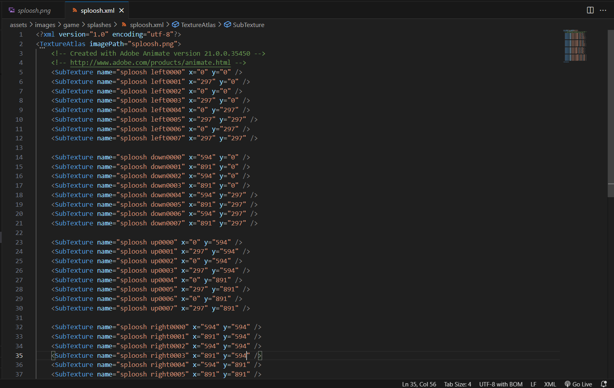

# Note Splashes

First, you need to put the .png and .xml of the note splashes into ``images/game/splashes/``
The filename should be the name you want to reference the splashes in the data, in this case we'll use ``sploosh``.
Here is how the spritesheet should look like:

<!-- TODO: get custom ones so we dont have to worry about copyrights -->



Keep in mind the names of the animations in the .xml because you will need them to form the splashes data.

## <h2 id="making-the-splash-xml">Making the splash xml</h2>

Next, you need to make a .xml file for the data of the splashes, you can do this by placing the xml file in ``data/splashes/sploosh.xml``
```xml
<!DOCTYPE codename-engine-splashes>
<splashes sprite="game/splashes/sploosh" alpha="0.6">
	<strum id="0"> <!-- LEFT -->
		<anim name="splash purple" anim="sploosh left" fps="24" x="0" y="0" />
	</strum>
	<strum id="1"> <!-- DOWN -->
		<anim name="splash blue" anim="sploosh down" fps="24" x="0" y="0" />
	</strum>
	<strum id="2"> <!-- UP -->
		<anim name="splash green" anim="sploosh up" fps="24" x="0" y="0" />
	</strum>
	<strum id="3"> <!-- RIGHT -->
		<anim name="splash red" anim="sploosh right" fps="24" x="0" y="0" />
	</strum>
</splashes>
```

Heres what the essential variables for the data .xml are:

To start, <syntax lang="xml">&lt;splashes&gt;</syntax> is where you start with. It has basic attributes like:
- ``sprite``: The sprite that appears for the note splashes (starting from ``./images/``).
- ``alpha``: The visibility of the splash, with 1being completely solid and 0 being useless because it just   makes the splash transparent. (default is <code class="hljs-string">1</code>).
- ``antialiasing``: Changes if the splashes are antialiased or not. (default is <code class="hljs-string">true</code>).
- ``scale``: The scale the splashes show up as. (default is <code class="hljs-string">1</code>).

After defining the previous node, <syntax lang="xml">&lt;strum&gt;</syntax> is for defining each strum. It only has one singular attribute which is:
- ``id``: The ID of the splash you're making data for. (left = 0, down = 1, etc.).

Then, to define the animation of the splash (or animations since you can have multiple of those) use <syntax lang="xml">&lt;anim&gt;</syntax>, the following attributes are:
- ``name``: This is the name of the animation that you're editing in the data
- ``anim``: This is the name of the animation that you're editing in the spritesheet .xml file.
- ``fps``: The framerate of the animation. (default is <code class="hljs-string">24</code>).
- ``x``: This is the X offset (use this if the splash is not centered on the arrow).
- ``y``: This is the Y offset (use this if the splash is not centered on the arrow).

## <h2 id="making-the-splash-show-up">Making the splash show up</h2>

Now that you setup the note splashes, you have to code them in. <br>
All you have to do is add this one piece of code in a Gameplay Script: *(change <code class="hljs-string">"sploosh"</code> to the name of the splashes you just made)*
```haxe
function onPlayerHit(e)
{
	e.note.splash = "sploosh";
}
```
And then this is how they should look in-game or something like that.

<!-- muted is required for autoplay on chromium -->
<video width="360" height="360" autoplay muted loop>
  <source src="./note-splashes.webm" type="video/webm">
  Your browser does not support the video tag.
</video>
